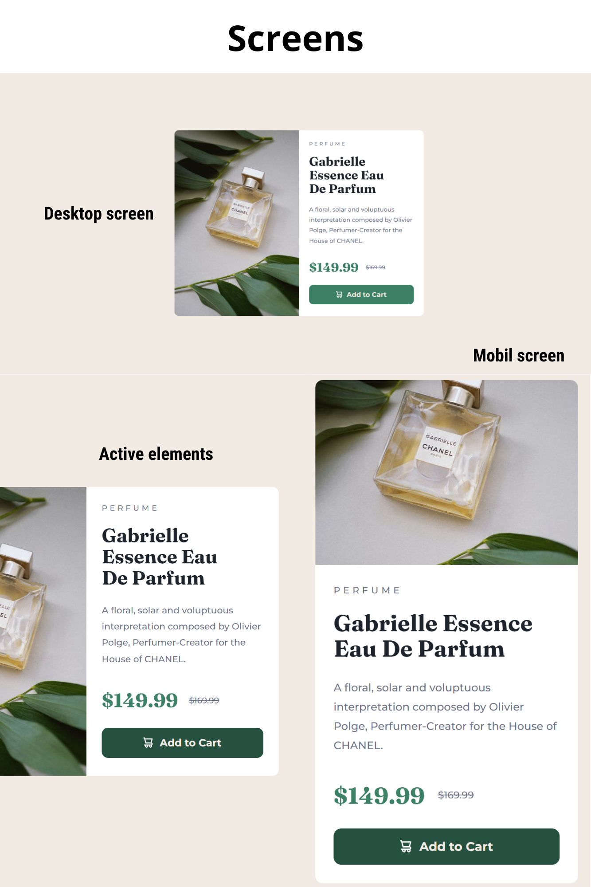

# Product preview card component

This is my solution to the Product preview card component challenge on Frontend Mentor

## Table of contents

- [Overview](#overview)
  - [The challenge](#the-challenge)
  - [Screenshot](#screenshot)
  - [Links](#links)
- [My process](#my-process)
  - [Built with](#built-with)
  - [Useful resources](#useful-resources)
- [Author](#author)

## Overview

### The challenge

Users should be able to:

- View the optimal layout depending on their device's screen size (mobil, tablet, desktop)
- See hover and focus states for interactive elements

### Screenshot

### Links

- Solution URL: [Add solution URL here](https://your-solution-url.com)
- Live Site URL: [https://oppahero.github.io/product-preview-card-component/](https://oppahero.github.io/product-preview-card-component/)

## My process

### Built with

- Semantic HTML5 markup
- CSS custom properties
- Flexbox
- CSS Grid
- Mobile-first workflow
- Media queries

#### CSS Specificity Graph

### Useful resources

These guides are super useful

- [Flex Guide](https://css-tricks.com/snippets/css/a-guide-to-flexbox/)

- [CSGridS Guide](https://css-tricks.com/snippets/css/complete-guide-grid/)

## Author

- Frontend Mentor - [@oppahero](https://www.frontendmentor.io/profile/oppahero)
